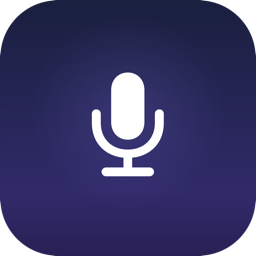

<p align="center">
  
</p>

<h1 align="center">WaveMute</h1>

<p align="center">
  A global mute shortcut for the Insta360 Wave USB microphone.<br>
  Lightweight, open source, and everything runs on your Mac.
</p>

<p align="center">
  <a href="#installation">Install</a> ·
  <a href="#usage">Usage</a> ·
  <a href="#how-it-works">How it works</a> ·
  <a href="CHANGELOG.md">Changelog</a> ·
  <a href="CONTRIBUTING.md">Contributing</a>
</p>

<p align="center">
  <a href="https://github.com/leo-santanna/mic-mute-utility/actions/workflows/ci.yml"></a>
  <a href="https://github.com/leo-santanna/mic-mute-utility/releases"></a>
  
  
  
  <a href="https://buymeacoffee.com/leonardoebs"></a>
</p>

The official Insta360 Wave Controller app provides a popup to mute the mic, but no global keyboard shortcut. WaveMute fills that gap with a minimal menu bar app you can assign any hotkey to, with full LED sync and bidirectional Google Meet integration.

## Features

- **Global hotkey** — configurable, defaults to F9. Works on any keyboard.
- **Hardware-level mute** — mutes the mic at device firmware level via HID Output Report 6, not through CoreAudio, so meeting apps never show a "microphone muted by system" warning.
- **LED sync** — the mic's front LED turns red when muted, exactly like the official app.
- **Physical button sync** — muting via the mic's built-in touch display updates the menu bar icon in real time.
- **Google Meet integration** — muting propagates to any active Meet call (Chrome tab or PWA), and clicking mute inside Meet syncs back within 500ms.
- **Launch at login** — optional, toggled from the menu.
- **No runtime dependencies** — `libhidapi` is bundled inside the app.

## Requirements

- macOS 14 (Sonoma) or later
- Insta360 Wave USB microphone

## Installation

Download the latest `WaveMute.app.zip` from the [Releases](https://github.com/leo-santanna/mic-mute-utility/releases) page, unzip, and drag `WaveMute.app` to `/Applications`.

On first launch, right-click the app and choose **Open** to bypass Gatekeeper (the app is ad-hoc signed, not notarized). After that, it opens normally.

### Build from source

If you prefer to build locally:

```bash
brew install hidapi
git clone https://github.com/leo-santanna/mic-mute-utility.git
cd mic-mute-utility
bash build.sh
cp -r WaveMute.app /Applications/
xattr -cr /Applications/WaveMute.app
open /Applications/WaveMute.app
```

## Usage

Once running, a microphone icon appears in the menu bar:

| Icon | State |
|------|-------|
| `mic.fill` (white/black) | Unmuted |
| `mic.slash.fill` (red) | Muted |

**Toggle mute:** press the configured hotkey (default **F9**), click the mic's physical button, or use *Toggle Wave Mute* in the menu.

**Change the hotkey:** click the menu bar icon, then *Change Shortcut...*, press the key combination you want, and click *Save*.

**Launch at login:** click the menu bar icon and toggle *Launch at Login*.

**About:** click the menu bar icon and select *About WaveMute* to open the About window with links to GitHub and Buy Me a Coffee.

## How it works

### Mute mechanism

The Insta360 Wave Controller app communicates with the mic over a proprietary Mavlink-based protocol tunnelled through USB HID (vendor usage page `0xFF00`, Report ID 3). That channel requires cloud authentication and is not publicly documented.

Through reverse engineering the HID descriptor and firmware behaviour, we found a simpler path:

- **HID Output Report 6** (`[0x06, 0x01]` = mute, `[0x06, 0x00]` = unmute) controls both the audio gate and the LED directly at the firmware level, with no authentication required.
- The device reflects its mute state in **byte[29]** of the periodic vendor heartbeat it broadcasts (Report ID 3, type `0xEF`). WaveMute reads this to stay in sync with physical button presses.
- Report 6 causes the device to briefly mirror its state through the USB Audio Class mute control (which macOS CoreAudio exposes), so meeting apps could detect a "system mute" event. WaveMute subscribes to that CoreAudio property and immediately resets it to `0`, so the OS never reports the mic as system-muted.

### Google Meet sync

Meet sync works via `osascript` subprocesses — no Accessibility permission is required from the app binary.

- **Chrome tab:** JS injection clicks the mic button by `aria-label`.
- **Meet PWA:** `System Events` keystroke `Cmd+D` delivered to `app_mode_loader`.
- **Inbound:** polls the mic button `aria-label` every 500ms; when Meet's state changes externally, it syncs back to the Wave mic.

### Device identifiers

| Property | Value |
|----------|-------|
| USB Vendor ID | `0x18F0` (insta360) |
| USB Product ID | `0x4E40` |
| HID interface | Interface 3 (`bInterfaceClass 3`, `PrimaryUsagePage 0xFF00`) |
| Mute LED report | Output Report ID `0x06`, bit 0 |
| Mute state in heartbeat | Report ID `0x03`, type `0xEF`, byte offset 29 |

## Project structure

```
mic-mute-utility/
├── WaveMute/
│   ├── main.swift              # App entry point
│   ├── AppDelegate.swift       # Menu bar, hotkey, orchestration
│   ├── HIDMonitor.swift        # Persistent HID read/write loop
│   ├── MeetSync.swift          # Google Meet bidirectional sync
│   ├── ShortcutRecorder.swift  # Hotkey capture window
│   ├── AboutWindow.swift       # About window
│   ├── MenuBarIcons.swift      # SF Symbol icon helpers
│   ├── LaunchAtLogin.swift     # LaunchAgent plist install/uninstall
│   ├── Info.plist              # Bundle metadata
│   └── AppIcon.icns            # App icon
├── docs/assets/                # Images used in the README
├── icon.iconset/               # Source PNGs for the icon (all required sizes)
├── make_icon.swift             # Script to regenerate AppIcon.icns
├── build.sh                    # One-step build + bundle + sign script
└── README.md
```

## Building

```bash
bash build.sh
```

This compiles all Swift sources, bundles `libhidapi.dylib` from Homebrew into `WaveMute.app/Contents/Frameworks/`, sets the correct rpath, ad-hoc signs each component in dependency order, and clears the quarantine attribute.

## Reverse engineering notes

The investigation that led to this utility involved:

1. Identifying the device via `ioreg`: VID `0x18F0`, PID `0x4E40`
2. Decoding the HID report descriptor to map all input/output report IDs and their usages
3. Disassembling the Qt binary (`PSP::HidMavlinkController`, `PSP::PcMavlink`) to understand the vendor Mavlink protocol and mute command IDs (`SetMicMute` -> msg `0x2B`)
4. Empirically testing each HID output report to identify which one controls the LED and audio gate
5. Capturing the periodic heartbeat to find the byte that reflects device mute state
6. Discovering the CoreAudio bounce-back and implementing the property listener guard

## Contributing

Contributions are welcome. See [CONTRIBUTING.md](CONTRIBUTING.md) for the development workflow, branch conventions, and commit message format.

Some areas that could be improved:

- **Notarized release**: sign with an Apple Developer certificate so users don't need to clear quarantine manually
- **Xcode project / SPM**: replace the `build.sh` script with a proper package structure
- **Other Insta360 devices**: the HID approach may work for other mics in the lineup with minor adjustments to report IDs or heartbeat byte offsets
- **Menu bar refinements**: show mic level, handle device disconnect/reconnect gracefully

Please open an issue before starting significant work so we can coordinate.

## License

MIT - see [LICENSE](LICENSE).

## Acknowledgements

- [hidapi](https://github.com/libusb/hidapi) - the HID library bundled at runtime
- Insta360 for building a microphone with accessible HID endpoints
